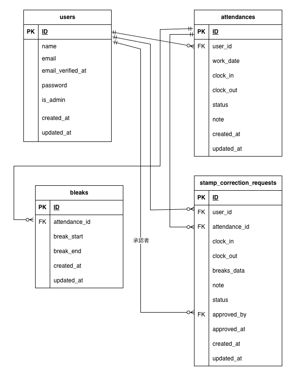

# Atte（勤怠管理システム）

## 環境構築

### Dockerビルド
1. git clone https://github.com/shiroyama373/attendance-app.git
2. cd attendance-app
3. docker-compose up -d --build

※ MySQLは、OSによって起動しない場合があるのでそれぞれのPCに合わせて docker-compose.yml ファイルを編集してください。

### Laravel環境構築
1. composer install を実行
```bash
   docker-compose run --rm app composer install
```
2. コンテナを再起動
```bash
   docker-compose restart
```
3. .env.exampleファイルを.envにコピー
```bash
   docker-compose exec app cp .env.example .env
```
4. アプリケーションキーを生成
```bash
   docker-compose exec app php artisan key:generate
```
5. マイグレーション実行
```bash
   docker-compose exec app php artisan migrate
```
   ※ データベースが存在しない場合、「Would you like to create it?」で **Yes** を選択
   
6. シーダー実行
```bash
   docker-compose exec app php artisan db:seed
```

### 全ユーザーをメール認証済みにする
```bash
docker-compose exec db mysql -u root -proot -D attendance_db -e "UPDATE users SET email_verified_at = NOW();"
```
### サーバー起動
```bash
docker-compose exec app php artisan serve --host=0.0.0.0 --port=8001
```

## 使用技術
- PHP 8.2
- Laravel 10.x
- MySQL 8.0

## URL
- 開発環境：http://localhost:8001/
- phpMyAdmin：http://localhost:8080/
- MailHog：http://localhost:8025/

## ER図



## テストアカウント
### 管理者
- メール：admin@example.com
- パスワード：password123

### 一般ユーザー
- メール：yamada@example.com
- パスワード：password123